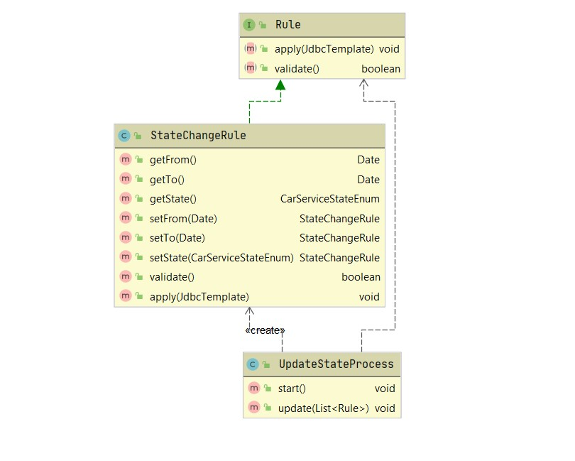

# Данные о продажах и контрактах.

* В качестве процесса, который запускается в определённое время использую Spring scheduler  **@Scheduled** 

* **@Scheduled(cron = "0 05 16 * * * ")** секунды, минуты, часы соответственно, для запуска определённого процесса на Java

#

```
  Иерархия классов
```



#


* Чтобы сделать дополнительнй год сервис достаточно создать Service4RuleImpl класс, расширающий абстрактный класс StateChangeRule и изменить в переопределённных методах условия.
* Для формирования команды, которая обзванивает клиентов создан абстрактный класс SupportNotifyRule, который унаследован от общего интерфейса Rule. Точно таким же образом можно создать правила для обзвона клиентов, создав дочерние классы (правила), которые расширяют данный абстрактный класс SupportNotifyRule.

#
База генерируется при запуске приложения, создаётся 100 000 записей.
