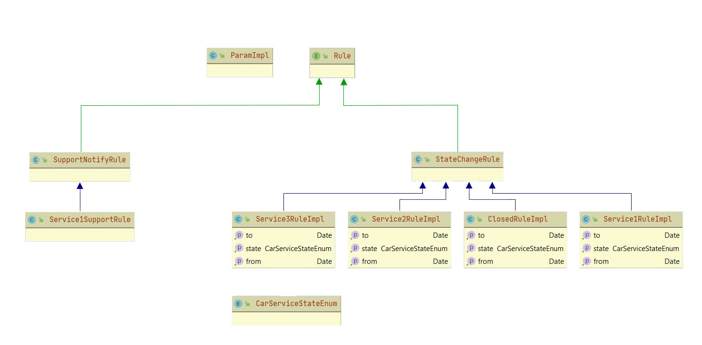

# Данные о продажах и контрактах.

* В качестве процесса, который запускается в определённое время использую Spring scheduler  **@Scheduled** 

* **@Scheduled(cron = "0 05 16 * * * ")** секунды, минуты, часы соответственно, для запуска определённого процесса на Java

#

```
  Иерархия классов
```


